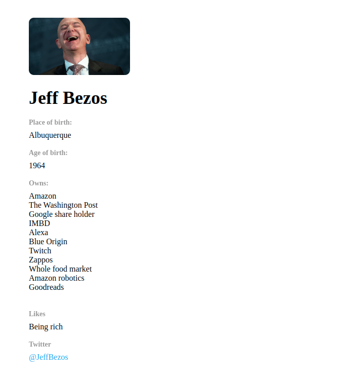

### 1. [The Challenge: Display Data using JSX](https://www.robinwieruch.de/react-pass-props-to-component)

In this challenge, we will give you `user` data and you have to display it using JSX. The main tasks are:

- Show data
- Bind data to an HTML attribute `<img src=`
- Create a link to the user's Twitter profile: `https://twitter.com/tim`
- Use map array function to list all the companies

```js
const user = {
  name: "Jeff Bezos",
  city: "Albuquerque",
  born: 1964,
  likes: "Being rich",
  twitterLink: "https://twitter.com/jeffbezos",
  img: "https://img-cdn.inc.com/image/upload/w_1920,h_1080,c_fill/images/panoramic/getty_1032942302_dkawzr.jpg",
  twitterName: "JeffBezos",
  companies: [
    "Amazon",
    "The Washington Post",
    "Google share holder",
    "IMBD",
    "Alexa",
    "Blue Origin",
    "Twitch",
    "Zappos",
    "Whole food market",
    "Amazon robotics",
    "Goodreads",
  ],
};
```



Bonus challenges you can complete are:

- Create a reusable component for the user details. Pass data to it using props.
