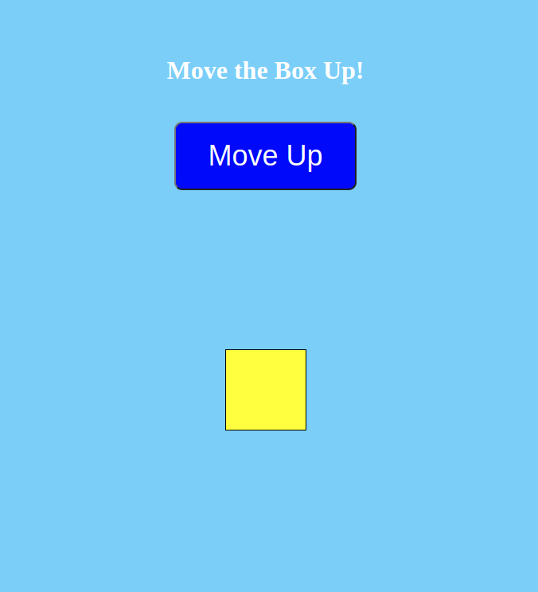

### 4. [The Challenge: Move a Box Up](https://malcoded.com/posts/react-component-style/)

The goal of this task is to move the box upwards when the button is clicked.

The tasks in this challenge are:

- Use state to hold the value of the transformation points.
- Create an event handler which will decrement the transformation points when the button is clicked
- Use the transformation points value with inline CSS to move the box upwards

`Here's what the final application looks like:`

Hints:

> Use inline style

> `translateY(${transformationPoints}px)`;
